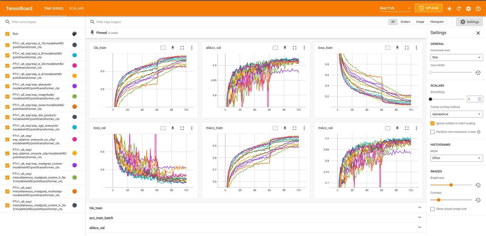

# Point Transformer

This repository contains my code and report for the NPM3D Project (MVA 2025/2026) by, building upon the unofficial Point Transformer implementation (the code for the shape classification part of the model was never added).

- **My forked implementation**: https://github.com/TopAgrume/point-transformer
- **Base unofficial implementation**: https://github.com/POSTECH-CVLab/point-transformer

## Project summary

This project proposes a study of the [Point Transformer](https://arxiv.org/abs/2012.09164), a transformer-based architecture for 3D point cloud understanding.
- My primary goal is to reproduce the results of the original paper on the ModelNet40 shape classification task. This implementation achieves an overall accuracy of 92.7%, which is close to the 93.7% reported by the authors.
- Beyond reproduction, the project includes a series of ablation studies and architectural modifications to better understand the behavior of the model.

## Experimental results

**Shape classification on ModelNet40:**
| Model | Overall accuracy (OA) | Mean class accuracy (mAcc) |
|-------|-----------------------|----------------------------|
| Current implementation | 92.67% | 90.25% |
| Original paper | **93.7%** | **90.6%** |

## My codebase additions and modifications
* Created `model/pointtransformer/pointtransformer_cls.py` (massively adapted from the existing segmentation model pointtransformer_cls.py).
* Created `util/modelnet40.py` to handle loading data specifically for the ModelNet40 dataset.
* Created `util/profiler.py` in order to measure the computational latency of each component of my implementation during the evaluation.
* Modified `tool/train.py` and `tool/test.py` to support classification tasks and configuration file selections.

## Dependencies
- Ubuntu: 18.04 or higher
- PyTorch: 1.9.0
- CUDA: 11.1
- Hardware: GPUs required to reproduce [Point Transformer](https://arxiv.org/abs/2012.09164)
- To create conda environment, command as follows:
  ```
  bash env_setup.sh pt
  ```

## Dataset preparation
Download the pre-processed `modelnet40_normal_resampled` dataset from Kaggle: [ModelNet Normal Resampled](https://www.kaggle.com/datasets/chenxaoyu/modelnet-normal-resampled)

Unzip the downloaded file and save it in `dataset/modelnet40_normal_resampled`.

Note: Loading the dataset takes a long time during the first session because it caches the arrays directly into shared memory for fast access.

**Shape classification on ModelNet40:**
- Train a model (6 mn of caching): `sh tool/train.sh modelnet40 pointtransformer_cls`
- Modify hyperparameters: Edit the configuration file located at `config/modelnet40/modelnet40_pointtransformer_cls.yaml`.
- Test the best model (2 mn of caching): `sh tool/test.sh modelnet40 pointtransformer_cls`

**Semantic segmentation on S3DIS:**\
Take a look at the base unofficial implementation repository.


## Checkpoints and training logs

All experiments, model checkpoints, and training logs can be viewed and downloaded from the following link:
[Download Checkpoints & Logs (Google Drive)](https://drive.google.com/drive/folders/1tE3P4D_KuZ0_yU5Ot1wu2gK9wgXfbFMX?usp=sharing)

Once downloaded and unzipped, you can easily visualize the training curves and metrics using TensorBoard. Navigate to the extracted folder in your terminal and run:

```bash
tensorboard --logdir=.
```

The following window will appear:



## Reproducing figures
To reproduce the plots and graphs I used in the project report, run the following scripts:
- `figures/treemap.py`
- `figures/pareto.py`
- `figures/graphs_generation_for_report.py`

## References

```
@inproceedings{zhao2021point,
  title={Point transformer},
  author={Zhao, Hengshuang and Jiang, Li and Jia, Jiaya and Torr, Philip HS and Koltun, Vladlen},
  booktitle={Proceedings of the IEEE/CVF International Conference on Computer Vision},
  pages={16259--16268},
  year={2021}
}
```